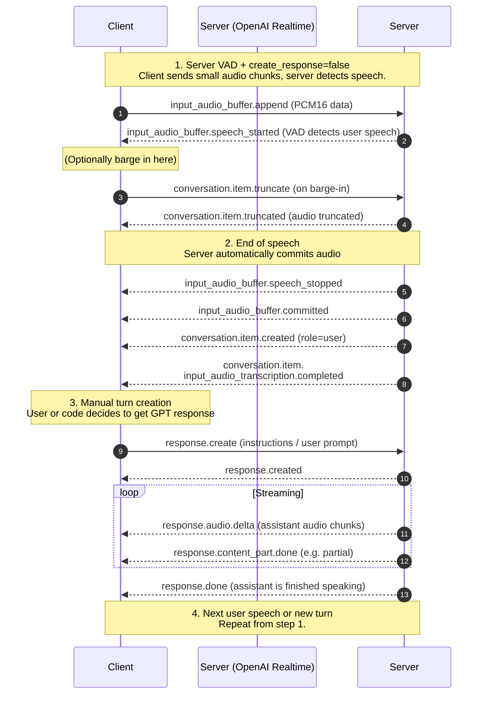

# gpt-realtime

## About

This repository serves the purpose of providing a space to experiment with the OpenAI Realtime API.

While there are both a WebRTC and a WebSockets version, I will be primarily exploring the WebSockets version.

The plan is to include both some Python and JavaScript code showcasing the core functionality of the API, especially with regards to voice interaction.

### Some resources:

https://platform.openai.com/docs/guides/realtime-model-capabilities
https://platform.openai.com/docs/guides/realtime-websocket
https://platform.openai.com/docs/api-reference/realtime

## Python version

An implementation of the GPT Real Time API using WebSockets. It is built in Flask and has a very simple single page for the front end that uses vanilla HTML and JavaScript.

So far, it successfully interacts with the Real Time API (using the `gpt-4o-realtime-preview-2024-12-17` beta model). It handles voice that is recorded via the browser and converted using `ffmpeg` (server side as a subprocess).

It still needs some tweaking to get the live prompts working right as the last testing resulted in it simply repeating back what I had said to it.

## JavaScript version

There is now a Node/Express/React version of the same application. It has the same functionality as the Python version currently, only, for whatever reason, the first test case worked flawlessly without having to make any adjustments to the intercepted prompts. Perhaps my first test case for the Python version was just too trivial to expect any results (I simply uttered "Testing speech to text. Testing speech to text." - not much of a prompt, afterall).

### Tool Calls

...

### UML

